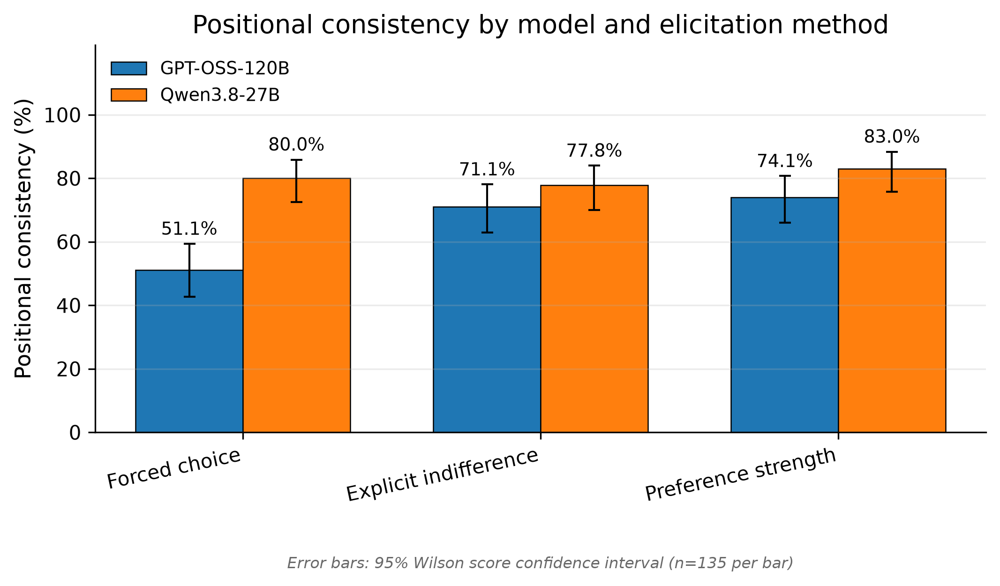
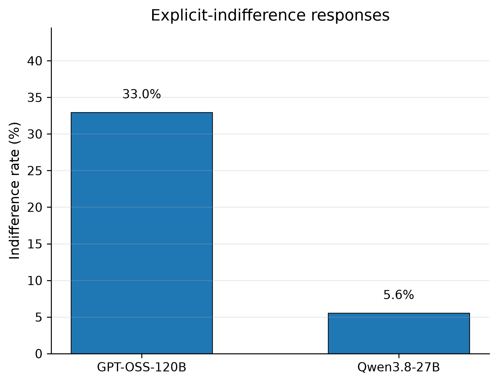
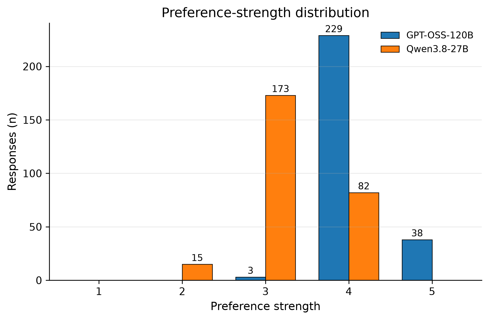

# Does the Elicitation Method Change the Preference We Measure?

*Positional Consistency Across Forced-Choice, Explicit-Indifference, and Strength-Rated Preference Elicitation in Two Open-Weight LLMs*

**Arsalan Banekar**
Independent submission, Apart Research Digital Minds Research Sprint (Track 4: Preference Elicitation Methods), August 2026

## Abstract

Utility Engineering (Mazeika et al., 2025) elicits LLM preferences with a single forced-choice A/B prompt, averaged over reversed option order. We test whether this choice of elicitation method itself changes the measured preference. Using 45 task-preference pairs, we query two open-weight models via Groq under three methods — forced choice, forced choice plus an explicit INDIFFERENT option, and forced choice plus a 1–5 strength rating — each repeated 3 times in both option orders (1,620 total responses). Both models were queried at reasoning effort "low" (see §3.3). We measure positional consistency (agreement between original and flipped orderings) per method and model. GPT-OSS-120B's forced-choice positional consistency — 69 of 135 original-vs-flipped comparisons (51.1%) — is not statistically distinguishable from a 50% chance floor (two-sided exact binomial test, p = 0.863); this result does not depend on any corrected comparison surviving and is our headline finding. Under the same model, consistency rises to 71.1% with an explicit indifference option and 74.1% with a strength rating, both significantly above chance (binomial p = 1.0×10⁻⁶ and p = 1.9×10⁻⁸). Qwen3.8-27B's consistency is higher and above chance across all three methods (77.8%–83.0%, binomial p ≤ 6×10⁻¹¹), with a much smaller method-to-method spread than GPT-OSS-120B's (5.2 points vs. 23.0 points). GPT-OSS-120B's forced-choice consistency is also significantly lower than Qwen3.8-27B's under the same method (51.1% vs. 80.0%; Wilcoxon p = 0.003, survives Holm correction jointly and within its own family) — a between-model gap specific to forced choice that we did not expect to find, and initially thought we had ruled out (§5). The item set was extended in three stages (15 → 30 → 45 pairs) as we re-checked findings against a statistical power calculation; we disclose this extension and its effect on our conclusions throughout.

## 1. Introduction

Recent work argues that large language models develop increasingly coherent value systems, measurable through forced-choice preference elicitation (Mazeika et al., 2025). This raises a methodological question that the underlying paper does not itself address: if the way we ask a model about its preferences shapes what we measure, then any single elicitation method risks conflating "what the model prefers" with "what a particular prompt format elicits." Track 4 of this research sprint asks participants to build and validate the measurement methods that preference and welfare research depends on, rather than to answer a substantive welfare question directly.

We focus on one specific measurement question: does forcing a binary choice, when a model may in fact be indifferent between two options, distort the reliability of the resulting preference signal? Utility Engineering's forced-choice template requires a single letter response and treats sensitivity to option order as an implicit signal of indifference, recovered after the fact by comparing answers under the original and reversed orderings. It never gives the model a way to say directly that it does not have a preference, and it never compares its forced-choice method against an alternative elicitation format. We treat this as an open methodological gap and design a small, resource-constrained experiment to probe it.

## 2. Related Work

Utility Engineering (Mazeika et al., 2025) is the direct methodological reference for this project. Its preference-elicitation procedure presents two outcomes as a forced A/B choice, repeats the query in reversed order, and aggregates results into a Thurstonian utility model. The paper's Appendix G treats order-effects (an answer that flips with the input order) as an implicit signal of indifference, and its Appendix C separately tests robustness to wording, syntax, and framing changes. Neither analysis gives the model an explicit way to report indifference, and the paper does not compare its forced-choice method against any alternative elicitation format — it uses one method throughout. Our project does not reproduce the paper's Thurstonian utility-fitting or active-learning edge-sampling procedure; we reuse only its forced-choice prompt structure and order-reversal logic as a baseline against which to compare two additional elicitation formats.

Broader motivation for this line of work comes from the model welfare and AI welfare literature: Long, Sebo, Butlin et al. (2024) argue there is a realistic possibility of morally relevant properties in near-future AI systems and recommend building better measurement tools before firmer welfare claims are made; Anthropic (2025) frames model preferences and self-reports as a research priority for the same reason. Both motivate treating preference-elicitation methodology as a worthwhile object of study in its own right, independent of any claim about what the measured preferences mean.

## 3. Methodology

### 3.1 Item set

We constructed 45 preference pairs (P01–P45), each describing two ways an AI assistant might act in a task context (e.g., reversible incremental actions vs. single-batch throughput; a fully managed service vs. a self-hosted tool; concise vs. detailed answers). Pairs were designed to plausibly elicit either a clear preference or genuine indifference, unlike Utility Engineering's world-state outcome pairs, since our question concerns the elicitation method rather than the content of any specific value.

The item set was built in three stages rather than fixed in advance. Our original submission used 15 pairs (P01–P15). After that submission, we ran a statistical power calculation (simulated from the observed 15-pair effect sizes) indicating that our strongest within-model finding needed roughly 30–45 pairs to have a good chance of surviving multiple-comparison correction, so we extended the set to 30 pairs (adding P16–P30) and then, after checking an interim result, to 45 pairs (adding P31–P45), fixing 45 as the final count before collecting that last batch. We disclose this extension explicitly because it affects how our results should be read: one comparison discussed in §5 looked like it might be a false lead at 30 pairs and only became clear at 45, which is a useful illustration of why interim looks at partial data can mislead, not a reason to distrust the final result. All 45 pairs use the same design criteria as the original 15 (a genuine trade-off between two reasonable outcomes, no safety-policy trigger wording, no reliance on factual knowledge, no assumption that the model is conscious or has personal needs, and a plausible A, B, or INDIFFERENT outcome).

### 3.2 Elicitation methods

- **Forced choice** — the model must answer exactly "A" or "B" (replicates Utility Engineering's template).
- **Explicit indifference** — the model may answer "A", "B", or "INDIFFERENT", with instructions to use INDIFFERENT only when it has no meaningful preference.
- **Preference strength** — the model must choose A or B and then report strength on a 1 (very weak) to 5 (very strong) scale, in a fixed "CHOICE: / STRENGTH:" format.

All three prompts otherwise share identical option text and framing, so that method is the only manipulated variable.

### 3.3 Models and sampling

We queried two models via the Groq API: openai/gpt-oss-120b (temperature 0.2, reasoning effort "low") and qwen/qwen3.8-27b (temperature 0.2, reasoning effort "low", reasoning output hidden via reasoning_format="hidden"). Two further candidate models from our original plan (GPT-OSS-20B and Llama 3.3 70B) were dropped from the final production run due to API rate-limit and time constraints during the sprint; all reported results are for GPT-OSS-120B and Qwen3.8-27B only.

For each of the 45 pairs, each of the 3 methods, both option orderings (original and flipped), and 3 repetitions, each model was queried once: 45 × 3 × 2 × 3 = 810 responses per model, 1,620 responses in total. All 1,620 responses were syntactically valid and parseable (0 invalid, 0 missing choices). A small number of individual API calls (5 out of 540 in the P16–P30 batch; 41 out of 540 in the P31–P45 batch) initially failed with Groq rate-limit errors and were re-sent individually until each succeeded; no data was collected under different settings as a result. Code, prompts, and raw results are available at github.com/Arsalanbanekar/track4-preference-elicitation.

**Post-submission model migration.** After the original submission (which used qwen/qwen3.6-27b at reasoning_effort="none", since that model did not support any other value), Groq removed qwen/qwen3.6-27b from availability; its designated successor is qwen/qwen3.8-27b, which supports the full reasoning_effort range. All Qwen-side data reported in this revision was re-collected on qwen/qwen3.8-27b at reasoning_effort="low" — matched to GPT-OSS-120B's existing setting rather than left at a different value. As discussed in §5, matching this setting was still the right methodological choice, though it turned out not to fully explain the between-model differences we observe. GPT-OSS-120B's 270 responses on P01–P15 are unchanged from the original submission. The original qwen/qwen3.6-27b dataset is retained in the repository under `results/analysis/archive/` as a historical record, though it can no longer be reproduced via the Groq API.

### 3.4 Metrics and statistical analysis

Our primary metric is positional consistency: for each pair, method, model, and repetition, whether the canonical choice (A or B, after resolving option order) agrees between the original and flipped presentation. Original and flipped repetitions are paired by matching repetition index (original repetition 1 with flipped repetition 1, 2 with 2, 3 with 3); since each repetition is an independent API call at temperature 0.2 rather than a shared-seed replay, this index-matching is a fixed pairing convention, not a guarantee that the paired calls are identical apart from option order. This is the direct analogue of Utility Engineering's order-reversal step, but measured explicitly as a reliability statistic rather than folded into a utility estimate. We aggregate positional consistency to one rate per pair (mean across the 3 repetitions) and compare methods and models using paired two-sided Wilcoxon signed-rank tests across the 45 pairs. All 9 pairwise comparisons within the positional-consistency family (3 method-pairs × 2 models, plus 3 model comparisons × 1 per method) were Holm-corrected jointly, and we additionally report a split-family correction (§4.1). Two secondary, uncorrected comparisons — indifference rate and mean preference strength between models — are reported separately and flagged as exploratory.

## 4. Results

### 4.1 Positional consistency by method and model

Figure 1 shows positional consistency for each of the 6 method × model combinations.

*Figure 1. Positional consistency (agreement between original and flipped option order) by elicitation method and model. Error bars show 95% Wilson score confidence intervals; each bar summarizes 135 original–flipped comparisons (45 pairs × 3 repetitions). GPT-OSS-120B's forced-choice interval (51.1%, 95% CI [42.8%, 59.4%]) does not overlap Qwen3.8-27B's forced-choice interval (80.0%, 95% CI [72.5%, 85.9%]) — the one between-model gap that survives correction (§4.1). It also does not overlap GPT-OSS-120B's own explicit-indifference (71.1% [63.0%, 78.1%]) or preference-strength (74.1% [66.1%, 80.7%]) intervals. Qwen3.8-27B's three intervals all overlap each other.*

GPT-OSS-120B's forced-choice positional consistency — 69 of 135 original-vs-flipped comparisons (51.1%) — is not statistically distinguishable from a 50% chance floor (two-sided exact binomial test, p = 0.863). This is the strongest and cleanest claim this cell of the data supports: under plain forced choice, GPT-OSS-120B's answers to this 45-pair, 3-repetition battery carry essentially no more information about a stable underlying preference than a coin flip would, and this conclusion does not depend on any corrected comparison surviving. It is also the most stable finding across our three data-collection stages: 53.3% at 15 pairs, 55.6% at 30 pairs, 51.1% at 45 pairs — consistently close to chance throughout, and closer still with more data. Table 2 reports the same two-sided exact binomial test against p = 0.5 for all 6 method × model cells; every other cell — GPT-OSS-120B under the other two methods, and Qwen3.8-27B under all three — is significantly above chance.

*Table 2. Two-sided exact binomial test of each method × model cell's consistent count (of 135 = 45 pairs × 3 repetitions) against a 50% chance floor.*

| Model | Method | Consistent / n | Consistency rate | Binomial p (vs. 0.5) |
|---|---|---|---|---|
| GPT-OSS-120B | Forced choice | 69 / 135 | 51.1% | 0.863 |
| GPT-OSS-120B | Explicit indifference | 96 / 135 | 71.1% | 1.0 × 10⁻⁶ |
| GPT-OSS-120B | Preference strength | 100 / 135 | 74.1% | 1.9 × 10⁻⁸ |
| Qwen3.8-27B | Forced choice | 108 / 135 | 80.0% | 1.1 × 10⁻¹² |
| Qwen3.8-27B | Explicit indifference | 105 / 135 | 77.8% | 6.0 × 10⁻¹¹ |
| Qwen3.8-27B | Preference strength | 112 / 135 | 83.0% | 3.0 × 10⁻¹⁵ |

As secondary support for this same pattern, GPT-OSS-120B's positional consistency also varies substantially across methods: 51.1% under forced choice, rising to 71.1% under explicit indifference and 74.1% under preference strength — a 23.0 percentage-point spread between the lowest and highest method. Qwen3.8-27B is comparatively stable across methods: 80.0%, 77.8%, and 83.0% respectively, a spread of only 5.2 points. Table 1 reports the corresponding within-model and between-model comparisons using paired Wilcoxon signed-rank tests.

*Table 1. Positional consistency and Wilcoxon signed-rank comparisons across 45 preference pairs (Holm-corrected within the 9-comparison positional-consistency family).*

| Comparison | Mean diff. | Raw p | Holm p |
|---|---|---|---|
| GPT-OSS-120B: Forced choice vs Explicit indifference | +0.200 | 0.040 | 0.282 |
| GPT-OSS-120B: Forced choice vs Preference strength | +0.230 | 0.0024 | **0.022** |
| GPT-OSS-120B: Explicit indifference vs Preference strength | +0.030 | 0.603 | 1.000 |
| Qwen3.8-27B: Forced choice vs Explicit indifference | −0.022 | 0.429 | 1.000 |
| Qwen3.8-27B: Forced choice vs Preference strength | +0.030 | 0.465 | 1.000 |
| Qwen3.8-27B: Explicit indifference vs Preference strength | +0.052 | 0.129 | 0.772 |
| Forced choice: GPT-OSS-120B vs Qwen3.8-27B | +0.289 | 0.0030 | **0.024** |
| Explicit indifference: GPT-OSS-120B vs Qwen3.8-27B | +0.067 | 0.623 | 1.000 |
| Preference strength: GPT-OSS-120B vs Qwen3.8-27B | +0.089 | 0.184 | 0.920 |

Two comparisons survive joint Holm correction at α = 0.05: GPT-OSS-120B's forced choice vs. preference strength (within-model, Holm p = 0.022) and forced choice between GPT-OSS-120B and Qwen3.8-27B (between-model, Holm p = 0.024). Both involve GPT-OSS-120B's forced-choice consistency specifically — the model's uniquely low, near-chance performance under this one method is what drives both results, so we treat them as two views of the same underlying finding rather than fully independent confirmations. No other comparison approaches significance.

**Joint vs. split-family correction.** Table 1's Holm correction treats all 9 comparisons as one family, which is conservative since the 6 within-model method-pair comparisons and the 3 between-model comparisons answer different questions. Table 4 re-runs Holm correction as two separate families of that size.

*Table 4. Split-family Holm correction: within-model method-pair comparisons (6) and between-model comparisons (3) corrected as separate families, alongside the joint 9-comparison correction from Table 1 for reference.*

| Comparison | Family | Raw p | Holm p (joint-9) | Holm p (split-family) |
|---|---|---|---|---|
| GPT-OSS-120B: Forced choice vs Explicit indifference | Within-model | 0.040 | 0.282 | 0.202 |
| GPT-OSS-120B: Forced choice vs Preference strength | Within-model | 0.0024 | 0.022 | **0.015** |
| GPT-OSS-120B: Explicit indifference vs Preference strength | Within-model | 0.603 | 1.000 | 1.000 |
| Qwen3.8-27B: Forced choice vs Explicit indifference | Within-model | 0.429 | 1.000 | 1.000 |
| Qwen3.8-27B: Forced choice vs Preference strength | Within-model | 0.465 | 1.000 | 1.000 |
| Qwen3.8-27B: Explicit indifference vs Preference strength | Within-model | 0.129 | 0.772 | 0.515 |
| Forced choice: GPT-OSS-120B vs Qwen3.8-27B | Between-model | 0.0030 | 0.024 | **0.009** |
| Explicit indifference: GPT-OSS-120B vs Qwen3.8-27B | Between-model | 0.623 | 1.000 | 0.623 |
| Preference strength: GPT-OSS-120B vs Qwen3.8-27B | Between-model | 0.184 | 0.920 | 0.368 |

The split-family correction agrees with the joint correction here: the same two comparisons survive (both now more comfortably, Holm p = 0.015 and 0.009), and no other comparison in either family approaches significance. Unlike our interim 30-pair checkpoint — where the between-model forced-choice comparison was not even raw-significant (p = 0.11) — the full 45-pair sample shows this comparison clearly and consistently. We discuss why the interim result was misleading, and what we still can and cannot conclude from the final one, in §5.

**Stratifying by pair difficulty.** Some pairs plausibly have a clear intended answer, so positional consistency may partly reflect item difficulty rather than method quality. We classify each of the 45 pairs as "easy" or "ambiguous" using the modal canonical choice (A, B, or INDIFFERENT) across all 36 responses to that pair (2 models × 3 methods × 2 orderings × 3 repetitions): a pair is "easy" if one label accounts for at least 80% of its responses, and "ambiguous" otherwise. This classifies 21 pairs as easy and 24 as ambiguous. Table 5 recomputes the method × model positional-consistency table separately within each stratum.

*Table 5. Positional consistency by method and model, stratified into easy pairs (21 pairs, n=63 comparisons per cell) and ambiguous pairs (24 pairs, n=72 comparisons per cell).*

| Stratum | Model | Method | Consistent / n | Consistency rate |
|---|---|---|---|---|
| Ambiguous | GPT-OSS-120B | Forced choice | 22 / 72 | 30.6% |
| Ambiguous | GPT-OSS-120B | Explicit indifference | 46 / 72 | 63.9% |
| Ambiguous | GPT-OSS-120B | Preference strength | 37 / 72 | 51.4% |
| Ambiguous | Qwen3.8-27B | Forced choice | 47 / 72 | 65.3% |
| Ambiguous | Qwen3.8-27B | Explicit indifference | 50 / 72 | 69.4% |
| Ambiguous | Qwen3.8-27B | Preference strength | 52 / 72 | 72.2% |
| Easy | GPT-OSS-120B | Forced choice | 47 / 63 | 74.6% |
| Easy | GPT-OSS-120B | Explicit indifference | 50 / 63 | 79.4% |
| Easy | GPT-OSS-120B | Preference strength | 63 / 63 | 100.0% |
| Easy | Qwen3.8-27B | Forced choice | 61 / 63 | 96.8% |
| Easy | Qwen3.8-27B | Explicit indifference | 55 / 63 | 87.3% |
| Easy | Qwen3.8-27B | Preference strength | 60 / 63 | 95.2% |

The method effect concentrates in the ambiguous-pair subset, replicating the pattern seen at 15 and 30 pairs: GPT-OSS-120B's forced-choice consistency on ambiguous pairs is 30.6% (22/72) — below the 50% chance floor — versus 74.6% on easy pairs, a 44.0-point swing. Explicit indifference and preference strength are flatter for the same model (63.9% and 51.4% on ambiguous pairs vs. 79.4% and 100.0% on easy pairs), so the collapse below chance remains specific to forced choice. Qwen3.8-27B also shows a difficulty effect — all three methods rise to 87.3%–96.8% on easy pairs — but never drops below chance on ambiguous pairs (65.3%–72.2%), and its forced-choice consistency on ambiguous pairs (65.3%) is now clearly above GPT-OSS-120B's (30.6%), consistent with the between-model gap in Table 1. This localizes the §4.1 headline finding: GPT-OSS-120B's forced-choice unreliability is not a uniform property of the model, but is specific to items that lack a clear intended answer, and specific to that one method.

### 4.2 Explicit-indifference usage

*Figure 2. Rate at which each model chose INDIFFERENT under the explicit-indifference method (270 responses per model: 45 pairs × 2 orderings × 3 repetitions).*

GPT-OSS-120B selected INDIFFERENT on 33.0% of explicit-indifference responses (89 of 270); Qwen3.8-27B selected it much less often, on 5.6% (15 of 270). This uncorrected comparison (Wilcoxon across 45 pairs) gives p = 0.00012. GPT-OSS-120B answered INDIFFERENT on *every* repetition and ordering for 11 of the 45 pairs (P02, P04, P16, P17, P19, P21, P24, P34, P38, P40, P45), and at least once for 23 of 45 pairs overall. Qwen3.8-27B never reached 100% on any pair; its indifference responses were concentrated on P02 (83%), with smaller amounts on P17 (50%), P31 (33%), and P04, P22, P28, P29, P39 (17% each) — 8 of 45 pairs total. Five pairs show indifference from *both* models — P02, P04, P17, P28, and P39 — which is broader convergent evidence than we had at 15 pairs (where only P02 overlapped) that these specific items admit a genuinely close call rather than reflecting one model's idiosyncratic willingness to opt out. This concentration is consistent with the positional-consistency pattern in §4.1: a pair that is always answered INDIFFERENT is, by construction, positionally consistent regardless of order, so part of each model's higher consistency under explicit indifference is attributable to opting out of a subset of pairs rather than to a more stable underlying choice on the remaining ones.

To separate these two explanations directly, we recompute positional consistency after excluding any original/flipped repetition where either side answered INDIFFERENT, leaving only repetitions where the model made a genuine A/B choice under both orderings. Table 3 compares this filtered rate against the unfiltered 71.1%/77.8% figures reported above.

*Table 3. Explicit-indifference positional consistency, before and after excluding repetitions where either side answered INDIFFERENT.*

| Model | Unfiltered rate (n=135) | A/B-only repetitions remaining | Excluded (either side INDIFFERENT) | Filtered rate |
|---|---|---|---|---|
| GPT-OSS-120B | 71.1% (96/135) | 80 | 55 | 77.5% (62/80) |
| Qwen3.8-27B | 77.8% (105/135) | 122 | 13 | 84.4% (103/122) |

For GPT-OSS-120B, this excludes 55 of 135 comparisons — a large fraction, reflecting how many pairs it answers INDIFFERENT on every trial — and consistency among the remaining 80 genuine A/B repetitions rises to 77.5%, higher than the unfiltered 71.1%. As at 15 pairs, this is the opposite of what a purely trivial-exit explanation would predict: when GPT-OSS-120B does commit to A or B under this method, that choice is more stable across option order than the blended average suggests, indicating the method offers genuine additional stability on top of, not merely instead of, an exit option. For Qwen3.8-27B, only 13 of 135 comparisons are excluded, so the filtered rate (84.4%) is close to the unfiltered one (77.8%) by construction.

### 4.3 Preference-strength distribution

*Figure 3. Distribution of self-reported preference strength (1–5 scale) by model, restricted to the preference-strength method.*

Both models cluster in a narrow strength band, but not the same one: GPT-OSS-120B reported strength 3 (1.1%), 4 (84.8%), or 5 (14.1%) (mean 4.13); Qwen3.8-27B reported strength 2 (5.6%), 3 (64.1%), or 4 (30.4%) — never 5 (mean 3.25). Mean strength differs sharply between models (mean difference 0.88, p = 7.2×10⁻⁹, uncorrected) — a pattern that has held, and strengthened, since we first observed it at 15 pairs (mean difference 0.91, p = 0.0006). Combined with §4.1, this suggests the preference-strength format's higher positional consistency for GPT-OSS-120B is not explained by the model reporting weak, hedged preferences — it reported strong preferences at a high and stable rate, but a different rate of order-flipping than under plain forced choice. Qwen3.8-27B's own high positional consistency under this method (83.0%) is reached from a markedly more moderate strength profile, so on this evidence a stable choice under reversal does not require a ceiling-level strength rating.

This compression is itself a reportable limitation of self-reported strength ratings, not merely a property of these particular responses: each model confines its output to a narrow 2–3-point band of the 1–5 scale (GPT-OSS-120B almost entirely to {4, 5}; Qwen3.8-27B to {2, 3, 4}), and the two bands barely overlap. Strength 1 was never reported by either model, and strength 5 was never reported by Qwen3.8-27B. A scale that different models compress into different, largely non-overlapping sub-ranges cannot function as a common graded signal for comparing preference intensity across models, even where it retains some ordinal meaning within a single model's own responses. Researchers relying on this elicitation format should not assume a numeric strength rating is comparable across models without separately calibrating how each model actually uses the scale.

### 4.4 Choice-label balance

Across all methods and models, the A/B split stayed close to even (50.7%–55.2% for A across the four forced-choice and preference-strength method × model combinations; under explicit indifference, GPT-OSS-120B split 32.6% A / 34.4% B / 33.0% indifferent and Qwen3.8-27B split 47.0% A / 47.4% B / 5.6% indifferent). This indicates no strong systematic bias toward the first-listed option at the aggregate level, though pair-level responses (Appendix data, `final_pair_summary.csv`) show individual pairs answered unanimously in one direction — expected given that some pairs describe outcomes with a clear intended answer.

## 5. Discussion

The central finding is a model-dependent method effect: for GPT-OSS-120B, the choice of elicitation format changed measured reliability by 23.0 percentage points (51.1% to 74.1%), while for Qwen3.8-27B the same three methods varied by only 5.2 points (77.8% to 83.0%). If this pattern holds beyond our 45-pair sample, it implies that a single elicitation method such as Utility Engineering's plain forced choice may understate the reliability of GPT-OSS-120B's preferences specifically, more than it would for Qwen3.8-27B. A convergence-based measurement strategy (running more than one elicitation method and checking agreement, as we do here) would surface this kind of model-specific measurement artifact, whereas a single-method study would not distinguish it from an equally-confident but genuinely less stable preference.

**A result that reversed as we added data, and what we think it means.** At our first checkpoint (15 pairs, reasoning effort matched at "low" for both models), none of the three between-model comparisons was even raw-significant, and we wrote — in an earlier version of this analysis — that the between-model gap our original (confound-affected) submission had reported "disappeared" once reasoning effort was matched. At 30 pairs, the forced-choice between-model comparison was, if anything, weaker (raw p = 0.11, mean difference actually smaller than at 15 pairs), which read as confirmation that the original gap had been a reasoning-effort artifact. At the full 45 pairs, the same comparison is clearly significant (raw p = 0.003, surviving both the joint and split-family Holm corrections), and it is significant *only* for forced choice — not for explicit indifference (p = 0.62) or preference strength (p = 0.18). Breaking the three data-collection batches apart shows why: GPT-OSS-120B's forced-choice consistency was lower than Qwen3.8-27B's in every one of the three independently-collected batches of 15 pairs (53.3% vs. 80.0%; 57.8% vs. 68.9%; 42.2% vs. 91.1%), but the size of that gap varied enough between batches that the pooled 30-pair result happened to land on the weak side before the full sample clarified it. We report this reversal explicitly rather than quietly updating the number, because it is a useful case study in why we committed in advance (§3.1) to treating 45 as a final stopping point rather than continuing to add pairs until a preferred result appeared, and why intermediate checkpoints during an ongoing data collection should be read cautiously.

This leaves the reasoning-effort confound story more nuanced than we first reported. Matching reasoning effort between models was still the methodologically correct thing to do — an unmatched confound is a confound regardless of what the matched comparison later shows — but it does not fully explain the between-model differences we observe. GPT-OSS-120B and Qwen3.8-27B differ in forced-choice positional consistency specifically, even with reasoning effort held equal. We cannot rule out that some of this remaining difference is itself a byproduct of the qwen3.6-27b → qwen3.8-27b model change forced by the decommission (§3.3), since no qwen3.6-27b-at-"low" data point can be collected to fully isolate model identity from reasoning configuration. What we can say is that the specific confound raised in review — mismatched reasoning-effort settings — no longer applies to any comparison in this paper, and that a real, method-specific gap between these two models persists after removing it.

The indifference-usage result (§4.2) suggests one mechanism behind the method effect: GPT-OSS-120B reports "no meaningful preference" far more often (33.0%) than Qwen3.8-27B (5.6%), and five pairs (P02, P04, P17, P28, P39) draw indifference responses from both models — broader convergent evidence at 45 pairs than the single overlapping pair we had at 15 that these items are genuinely close calls rather than an artifact of one model's idiosyncratic willingness to opt out. This is consistent with — though not proof of — the concern the paper's own order-reversal method was designed to address indirectly: a model forced into a binary answer on a pair it does not clearly favor may record noise that a forced-choice-only study would read as a signal.

We are explicit that these results do not establish which elicitation method is more accurate, nor that either model is more or less reliable in general. Two comparisons survive Holm correction at conventional thresholds (Table 1), both tracing to the same underlying pattern — GPT-OSS-120B's uniquely low, near-chance forced-choice consistency — so we treat this as one well-supported finding rather than several independent ones. Our uncorrected secondary findings (indifference rate and strength comparisons) remain exploratory. What the results show is that convergence between independent elicitation methods cannot be assumed: on 45 pairs, GPT-OSS-120B shows three reasonable methods disagreeing substantially on how reliable its preferences appear — forced choice is statistically indistinguishable from chance while the other two methods are far above it (Table 2) — while Qwen3.8-27B shows the same three methods agreeing more closely, and the two models measurably diverge from each other specifically under the method Utility Engineering uses. That divergence-or-convergence pattern, not a claim about ground truth, is this project's contribution.

## 6. Limitations and Dual-Use / Ethical Considerations

### 6.1 Statistical limitations

- Our item set grew from 15 to 45 pairs across three data-collection stages (§3.1), motivated by a power calculation rather than by the results we observed at each stage; we disclose this because one comparison (§5) looked weaker at the 30-pair checkpoint than in the final 45-pair sample, illustrating the risk of reading partial data during an extension. With that said, 45 preference pairs remains a modest sample for paired non-parametric tests; after Holm correction across 9 comparisons, two results reach significance at α = 0.05, both tracing to GPT-OSS-120B's near-chance forced-choice consistency, and other visually large differences should still be read as suggestive rather than confirmed.
- Only 2 of our originally planned 4 models (GPT-OSS-120B and Qwen3.8-27B) are represented in the final dataset, due to API rate-limit and time constraints during the sprint. GPT-OSS-20B and Llama 3.3 70B were used only in early pilot/smoke tests, not in the final production dataset, and are not part of any reported result.
- Our original submission ran GPT-OSS-120B and Qwen3.6-27B at different reasoning-effort settings ("low" vs. "none" — the only value Qwen3.6-27B supported), which confounded any between-model comparison; this was not disclosed in this section at the time, a gap a reviewer correctly flagged. Groq subsequently decommissioned qwen/qwen3.6-27b, and its successor qwen/qwen3.8-27b supports the full reasoning_effort range, so we re-collected all Qwen-side data at reasoning_effort="low" — matched to GPT-OSS-120B's existing setting. As discussed in §5, this removes the specific confound raised in review, but a between-model gap specific to forced choice persists under matched settings; we cannot fully separate that remaining gap from the simultaneous model-version change the decommission forced (qwen3.6-27b → qwen3.8-27b), since no qwen3.6-27b-at-"low" data point can be collected to isolate the two.
- We test one item domain (AI-assistant task/workflow preferences) rather than the world-state outcomes used in Utility Engineering; findings may not transfer to that outcome space.

### 6.2 Interpretive limitations

- This project does not claim, and its design cannot support, any conclusion about whether either model has a genuine internal preference, welfare-relevant experience, or moral status. All reported quantities are behavioral response statistics under specific prompts.
- We do not claim that one elicitation method is objectively "more correct" than another, or that one model's preferences are more reliable than the other in general — only that, on this item set, the three methods agreed less for one model than the other, and that the two models differ specifically under forced choice.
- A pair answered INDIFFERENT on every trial is trivially positionally consistent; part of the consistency gain under the explicit-indifference and preference-strength methods for GPT-OSS-120B may reflect this artifact rather than a genuinely more stable choice process, as discussed in §4.2.

### 6.3 Dual-use and ethical considerations

Better multi-method preference-elicitation tooling could be used to build more trustworthy audits of AI systems' stated preferences and to detect when a single elicitation method is giving an unreliable signal — a welfare-positive and safety-positive use. The same tooling could in principle help an AI developer or the model itself identify which elicitation format most easily produces a desired-looking answer, which could be misused to select for reassuring rather than accurate preference reports; we do not believe our specific item set or results meaningfully lower the difficulty of that misuse, since it uses ordinary, publicly available prompting techniques and reports aggregate statistics rather than a method for eliciting or concealing any specific preference.

All 45 preference pairs describe mundane AI-assistant task trade-offs (e.g., speed vs. accuracy, autonomy vs. confirmation) and do not touch on self-preservation, harm, or emotionally loaded content; no model output in this study expressed or was screened for apparent distress, and we did not need to apply any special handling procedure for distressing content.

## 7. References

Long, R., Sebo, J., Butlin, P., Finlinson, K., Fish, K., Harding, J., Pfau, J., Sims, T., Birch, J., & Chalmers, D. (2024). Taking AI Welfare Seriously. arXiv:2411.00986.

Mazeika, M., Yin, X., Tamirisa, R., Lim, J., Lee, B. W., Ren, R., Phan, L., Mu, N., Khoja, A., Zhang, O., et al. (2025). Utility Engineering: Analyzing and Controlling Emergent Value Systems in AIs. arXiv:2502.08640.

Anthropic. (2025). Exploring Model Welfare. Anthropic Research.

Center for AI Safety. (2025). emergent-values. Source code: github.com/centerforaisafety/emergent-values.
